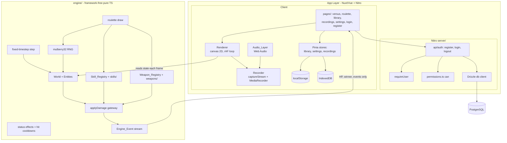
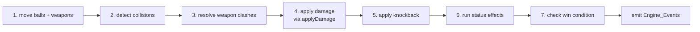
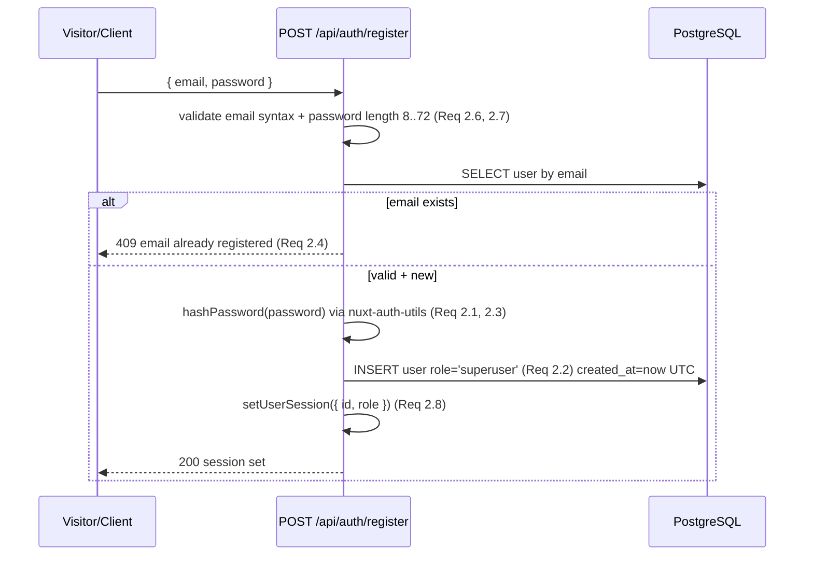

# Design Document: Ball Battle Simulator — Phases 2–9

## Overview

This design builds working feature behavior on top of the completed Phase 1 scaffold (Nuxt 3 + TypeScript, Tailwind, Pinia + `pinia-plugin-persistedstate`, the architecture-compliant folder tree, eight routable pages, a keyboard-accessible menu, and a portrait 9:16 layout). It covers Phases 2 through 9: authentication, the deterministic simulation engine, the skill and weapon systems, the versus page and renderer, roulette, library/local persistence, recording with audio, and settings/polish.

The system splits cleanly into two halves that never leak into each other:

- **The Engine** (`engine/`): framework-free, pure TypeScript. It owns all simulation state and logic — seeded RNG, the fixed-timestep loop, the entity World, collision math, the single `applyDamage` gateway, status effects, hit cooldowns, the skill and weapon registries, and the roulette draw. It imports nothing from Vue or Nuxt, calls neither `Math.random` nor any wall-clock time source, and is tested entirely with Vitest. The engine is the source of truth for correctness and is where every property-based test lives.
- **The App layer** (Nuxt/Vue + Nitro server): everything that is not simulation. Auth (Drizzle + PostgreSQL + `nuxt-auth-utils`, centralized `requireUser`/`can`), the canvas renderer, Pinia stores (`library`, `settings`, `recordings`), local persistence (localStorage + IndexedDB), the recorder (`canvas.captureStream` + `MediaRecorder`), and the Web Audio layer. The app layer reads only HP, winner, and events out of the engine and never binds per-frame engine state into Vue reactivity.

The guiding principle throughout: the engine is a deterministic function of `(seed, Duel_Config)`. Given identical inputs it produces identical outputs, byte for byte. Everything the app layer does — rendering, recording, saving — is a view onto, or a wrapper around, that deterministic core.

### New dependencies to add

Phase 1 did not install these; the design requires them:

- `nuxt-auth-utils` — sessions, password hashing (`hashPassword`/`verifyPassword`), `getUserSession`/`setUserSession`/`clearUserSession`.
- `drizzle-orm` + `drizzle-kit` — schema, query builder, migration generation/apply.
- `postgres` (the `postgres` npm driver) — PostgreSQL client used by Drizzle.
- A Vitest config file (`vitest.config.ts`) — the `test` script exists but no config file is committed yet; engine tests need `environment: 'node'` and app/component tests need `happy-dom`.
- A property-based testing library: **`fast-check`** (dev dependency) — used for all engine correctness-property tests.

All added runtime secrets live in environment variables; `.env.example` documents them with non-secret placeholders.

### Node engine requirement

`package.json` already declares `engines.node: ">=18.12.0"`. Development uses nvm; select a satisfying installed version (for example v18.20.8, v22.22.2, or v24.13.1) with `nvm use <version>` before install, dev, build, type-check, lint, or test. No Node version is hardcoded into committed source.

## Architecture

### Two-layer boundary



### Engine step data flow

Each engine `step()` executes the fixed order from architecture rule 12 exactly once per step (Requirement 5.7):



`applyDamage` is the only writer of HP. Skill hooks (`onHit`, `onHurt`, etc.) and weapon hits all route their damage back through `applyDamage`; nothing subtracts HP directly. Knockback is applied as a velocity impulse in step 5, status effects decrement/tick in step 6, and the win check in step 7 decides whether to emit `matchEnded`.

### Determinism strategy

Determinism (Requirement 5.6) is achieved by three disciplines, all enforced inside `engine/`:

1. **Single randomness source**: a mulberry32 generator seeded with a validated 32-bit unsigned integer. No `Math.random`, no `Date.now`, no `performance.now` anywhere in `engine/`. A test (and an ESLint boundary rule for `engine/**`) guards this.
2. **Fixed timestep**: every step advances exactly 1/60 s. Real elapsed time never enters the simulation. The app layer's rAF loop and the settings "simulation speed" only decide *how many* steps to run per real second; each step is still 1/60 s (Requirement 15.7).
3. **Stable iteration order**: entities live in an insertion-ordered array with monotonically increasing integer ids. Every per-step pass iterates that array in index order. Spawned entities (projectiles, split balls) append in a deterministic order derived from the current entity's id and the RNG. Collision pair enumeration is `for i < j` over the stable array, so pair order never depends on object identity or hashing.

Because the engine is a pure function of `(seed, Duel_Config)`, "rematch" (Requirement 11.10) is simply re-running with the stored config, and a saved `Duel_Config` replays identically on the same `engineVersion`.

### Client-only boundaries

The Renderer, Recorder, and Audio_Layer are browser-only (canvas, `MediaRecorder`, `AudioContext`). The versus page mounts them inside `onMounted` / `<ClientOnly>` and tears them down in `onUnmounted` (Requirements 11.6, 11.11, 14.11). The persistence stores read/write storage only in the browser (localStorage, IndexedDB).

### Simulation / render decoupling

The engine never calls `requestAnimationFrame`; the app layer owns the clock. The versus page runs a rAF loop that, each frame, advances the engine by the number of whole steps that the configured simulation speed dictates for the elapsed real time, then draws the current World. HP, winner, and events reach Vue only through a `shallowRef` snapshot and event callbacks updated at most once per frame — never a deep-reactive binding of entity state (Requirement 11.8).

## Components and Interfaces

### Engine: core module APIs (`engine/`)

#### RNG (`engine/rng.ts`)

```ts
export const SEED_MIN = 0;
export const SEED_MAX = 4_294_967_295; // 2^32 - 1

export interface Rng {
  /** next float in [0, 1) */
  next(): number;
  /** next integer in [0, n) for integer n > 0 */
  nextInt(n: number): number;
  /** current internal state, for snapshotting/debugging */
  readonly state: number;
}

/** Throws InvalidSeedError if seed is non-integer or outside [SEED_MIN, SEED_MAX]. */
export function createRng(seed: number): Rng;
```

mulberry32: a 32-bit state advanced per call. `createRng` validates the seed (Requirement 5.2, 5.9) and throws before any step runs.

#### Entities and World (`engine/world.ts`, `engine/entities.ts`)

```ts
export type EntityId = number; // monotonically increasing, stable order

export type EntityKind = 'ball' | 'projectile' | 'weapon';

export interface Vec2 { x: number; y: number; }

export interface BaseEntity {
  readonly id: EntityId;
  kind: EntityKind;
  position: Vec2;
  velocity: Vec2;
  alive: boolean;
}

export interface Ball extends BaseEntity {
  kind: 'ball';
  radius: number;
  hp: number;
  maxHp: number;
  contactDamage: number; // may be 0
  skills: SkillInstance[];
  weapons: WeaponInstance[];
  statusEffects: StatusEffect[];
}

export interface Projectile extends BaseEntity {
  kind: 'projectile';
  radius: number;
  damage: number;
  ownerId: EntityId; // credited attacker
}

export interface WeaponEntity extends BaseEntity {
  kind: 'weapon';
  ownerId: EntityId;
  def: WeaponDefinition;
  angle: number;      // orbit/orientation
  hitbox: Hitbox;     // resolved world-space hitbox this step
}

export type Entity = Ball | Projectile | WeaponEntity;

export class World {
  readonly entities: Entity[];          // stable insertion order
  readonly rng: Rng;
  readonly arena: ArenaConfig;
  tick: number;                          // whole steps elapsed
  add(entity: Entity): EntityId;         // appends, returns new id
  ballById(id: EntityId): Ball | undefined;
  aliveBalls(): Ball[];                  // filtered, order-preserving
}
```

#### Engine lifecycle (`engine/engine.ts`)

```ts
export const engineVersion = '1.0.0'; // non-empty string (Req 5.8)

export interface EngineOptions {
  seed: number;
  config: DuelConfig;
  onEvent?: (e: EngineEvent) => void;
}

export interface Engine {
  readonly world: World;
  /** advance exactly one fixed 1/60s step through the fixed step order */
  step(): void;
  /** true once matchEnded has been emitted */
  readonly ended: boolean;
  /** winner ball id, or null for a draw/no-winner, or undefined while running */
  readonly winner: EntityId | null | undefined;
  dispose(): void;
}

export const TIMESTEP = 1 / 60; // seconds (Req 5.4)

export function createEngine(opts: EngineOptions): Engine; // builds World from config, validates seed + skill/weapon ids
```

`step()` runs the seven operations in fixed order (Requirement 5.7). The engine emits events through `onEvent`; the app layer collects them without entering Vue reactivity per entity.

#### The damage gateway (`engine/damage.ts`)

```ts
export type DamageSourceTag =
  // active in phases 3-5
  | 'contact' | 'weapon' | 'projectile'
  // reserved, unimplemented (Req 6.5)
  | 'area' | 'dot' | 'environment' | 'beam' | 'summon' | 'reflect';

export interface DamageSource {
  readonly tag: DamageSourceTag;
}

export interface DamageFlags {
  readonly isReflected?: boolean; // reflected damage cannot reflect again (Req 6.9)
  readonly summonOwnerId?: EntityId; // when set, credits owner (Req 6.8)
}

export interface ApplyDamageInput {
  source: DamageSource;
  attackerId: EntityId | '';   // empty allowed (Req 6.7)
  targetId: EntityId;
  amount: number;
  flags?: DamageFlags;
}

export type ApplyDamageOutcome =
  | { kind: 'applied'; applied: number; killed: boolean; creditedAttacker: EntityId | '' }
  | { kind: 'noop'; reason: 'non-positive-amount' }
  | { kind: 'target-not-found' }
  | { kind: 'invalid-source' };

/**
 * The ONLY function that reduces Ball HP (Req 6.1).
 * - amount <= 0: no change, no event (Req 6.2)
 * - target not a living ball: no change, target-not-found (Req 6.3)
 * - source tag not in the union: no change, invalid-source (Req 6.6)
 * - summonOwnerId set: credited attacker = owner (Req 6.8)
 * - isReflected set: applies once, triggers no further reflection (Req 6.9)
 * - positive application: emits exactly one `damage` event (Req 6.10)
 * - HP reaches <= 0: clamps to 0, marks dead, emits exactly one `ballDied` (Req 6.11)
 */
export function applyDamage(world: World, input: ApplyDamageInput): ApplyDamageOutcome;
```

`applyDamage` is passed the `World` (which holds the event sink) rather than being a method, keeping it a single, easily audited choke point. Skills that react to damage (Vampire heal, Spike reflect) run as hooks fired *by* `applyDamage` after it applies HP, and their own damage goes back through `applyDamage` (with `isReflected` set for Spike).

#### Collision and physics (`engine/physics.ts`)

```ts
/** circle-vs-wall: negate normal component, reposition tangent to wall; returns true on bounce (Req 8.2) */
export function resolveWallCollision(ball: Ball, arena: ArenaConfig): boolean;

/** circle-vs-circle overlap test (Req 8.4) */
export function ballsOverlap(a: Ball, b: Ball): boolean;

/** push two overlapping balls apart along center line until tangent (Req 8.4) */
export function separateBalls(a: Ball, b: Ball): void;

/** small velocity impulse along striker->struck center line (Req 8.6) */
export function applyKnockback(striker: Ball, struck: Ball, magnitude: number): void;
```

All collision is hand-written circle math — no physics library (architecture rule, Requirement 8).

#### Status effects and hit cooldowns (`engine/status.ts`, `engine/cooldown.ts`)

```ts
export interface StatusEffect {
  readonly id: string;
  remaining: number;        // whole timesteps >= 0 (Req 7.1)
  readonly tickInterval: number; // whole timesteps >= 1 (Req 7.1)
  sinceLastTick: number;    // whole timesteps
  onTick(ball: Ball, world: World): void; // per-tick behavior
}

/** step 6: decrement duration, fire tick at interval, remove when duration hits 0 (Req 7.2-7.4) */
export function runStatusEffects(world: World): void;

export class CooldownTable {
  /** key = ordered (attackerId, targetId) pair */
  isActive(attackerId: EntityId | '', targetId: EntityId): boolean; // Req 7.5
  start(attackerId: EntityId | '', targetId: EntityId, duration: number): void; // Req 7.6
  decrementAll(): void; // one timestep per step (Req 7.8)
}
```

While a pair's cooldown is active, a repeated hit for that pair applies no damage, knockback, or status (Requirement 7.7).

#### Engine events (`engine/events.ts`)

```ts
export type EngineEvent =
  | { type: 'damage'; source: DamageSource; attackerId: EntityId | ''; targetId: EntityId; amount: number }
  | { type: 'skillTriggered'; skillId: string; ballId: EntityId }
  | { type: 'weaponClash'; a: EntityId; b: EntityId; outcome: 'bounce' | 'parry' | 'disarm' }
  | { type: 'ballDied'; ballId: EntityId }
  | { type: 'matchEnded'; winner: EntityId | null };
```

### Engine: skill system (`engine/skills/`)

```ts
export interface SkillContext {
  ball: Ball;
  world: World;
  source?: DamageSource; // readable on damage-driven hooks (Req 9.3)
  dealt?: { targetId: EntityId; amount: number };
  taken?: { attackerId: EntityId | ''; amount: number };
}

export interface SkillDefinition {
  readonly id: string;              // unique non-empty (Req 9.1)
  readonly config: Readonly<Record<string, number>>;
  onTick?(ctx: SkillContext): void;
  onHit?(ctx: SkillContext): void;      // this ball dealt damage
  onHurt?(ctx: SkillContext): void;     // this ball took damage
  onWallBounce?(ctx: SkillContext): void;
  onDeath?(ctx: SkillContext): void;
}

export interface SkillInstance {
  readonly def: SkillDefinition;
  config: Record<string, number>; // instance overrides
  state: Record<string, number>;  // e.g. firing timer for Blaster
}
```

Only the five hooks `onTick`, `onHit`, `onHurt`, `onWallBounce`, `onDeath` exist (Requirement 9.2). Each triggered skill emits exactly one `skillTriggered` event (Requirement 9.4).

#### Skill registry (`engine/skills/registry.ts`)

```ts
export class SkillRegistry {
  register(def: SkillDefinition): void; // rejects duplicate/empty id
  get(id: string): SkillDefinition | undefined;
  has(id: string): boolean;
  ids(): readonly string[];
}
export const skillRegistry: SkillRegistry; // populated by importing the five starter files
```

Resolving a ball config against the registry: an unknown skill id rejects the ball config with an error naming the id (Requirement 9.5).

#### Five starter skills (one file each in `engine/skills/`)

| File | id | Hook(s) | Behavior |
|------|----|---------|----------|
| `vampire.ts` | `vampire` | `onHit` | Heal by `healFraction` × damage dealt, clamped to `maxHp` (Req 9.6) |
| `spike.ts` | `spike` | `onHurt` | On `contact` damage, reflect `reflectAmount` to attacker via `applyDamage` with `isReflected` (Req 9.7) |
| `blaster.ts` | `blaster` | `onTick` | Every `fireInterval` steps, spawn one projectile credited to the ball (Req 9.8) |
| `splitter.ts` | `splitter` | `onDeath` | Spawn `splitCount` smaller balls at `radiusFactor` radius (Req 9.9) |
| `grower.ts` | `grower` | `onWallBounce` | Increase radius by `radiusGain` and speed by `speedGain` (Req 9.10) |

### Engine: weapon system (`engine/weapons/`)

```ts
export type WeaponMode = 'held' | 'orbit'; // only these two (Req 10.3)

export type Hitbox =
  | { shape: 'segment'; length: number; thickness: number }
  | { shape: 'circle'; radius: number }; // tip circle/box

export interface ProjectileSettings {
  speed: number;
  radius: number;
  damage: number;
  fireInterval: number; // steps
}

export interface WeaponDefinition {
  readonly id: string;        // unique non-empty (Req 10.1)
  readonly name: string;      // non-empty
  readonly mode: WeaponMode;
  readonly length: number;    // > 0
  readonly damage: number;    // >= 0
  readonly angularSpeed: number; // rad/s
  readonly weight: number;    // > 0
  readonly hitCooldown: number;  // ms, >= 0
  readonly hitbox: Hitbox;
  readonly projectile?: ProjectileSettings; // optional (Req 10.1, 10.10)
  readonly cannotBeParried?: boolean;        // Hammer (Req 10.11, 10.12)
}
```

#### Weapon registry (`engine/weapons/registry.ts`)

```ts
export class WeaponRegistry {
  register(def: WeaponDefinition): void; // validates every required field + bounds (Req 10.2)
  get(id: string): WeaponDefinition | undefined;
  ids(): readonly string[];
}
export const weaponRegistry: WeaponRegistry;
```

A definition missing a required field or with an out-of-bound value is rejected at registration, excluded from the registry, and surfaces an error naming the offending field (Requirement 10.2).

#### Weapon movement, hits, clashes

- **orbit** (step 1): `angle += angularSpeed × TIMESTEP`; `position = ownerPos + unit(angle) × orbitRadius` (Requirement 10.4).
- **held** (step 1): `position = ownerPos`; orientation points toward the target (Requirement 10.5).
- **hit** (steps 2+4): weapon hitbox overlaps an opposing ball and no active `hitCooldown` for the pair → `applyDamage` with source `weapon`, then start the pair cooldown (Requirement 10.6, 10.7).
- **clash** (step 3): two weapon hitboxes overlap → resolve to exactly one of `bounce | parry | disarm` by comparing `weight`, no direct damage, emit one `weaponClash` event (Requirement 10.8, 10.9). A weapon flagged `cannotBeParried` (Hammer) never yields a `parry` outcome (Requirement 10.12).
- **projectile** (Bow): weapon with `projectile` settings spawns a projectile on fire; projectile overlapping an opposing ball applies `projectile` damage credited to the owner (Requirement 10.10).

#### Five starter weapons

| File | id | mode | Notes |
|------|----|------|-------|
| `sword.ts` | `sword` | held | baseline |
| `hammer.ts` | `hammer` | held | heaviest `weight`; `cannotBeParried: true` (Req 10.11, 10.12) |
| `spear.ts` | `spear` | held | greatest `length` (Req 10.11) |
| `orbiting-blade.ts` | `orbiting-blade` | orbit | uses `angularSpeed` + orbit radius |
| `bow.ts` | `bow` | held | `projectile` settings present (Req 10.11) |

### Engine: roulette (`engine/roulette.ts`)

```ts
export interface RouletteResult {
  seed: number;
  skillId: string;
  weaponId: string;
}

/**
 * Draw exactly one skill + one weapon using a seeded Rng, selecting only from
 * current registry entries (Req 12.1, 12.5). Same seed + same registry contents
 * => identical result (Req 12.3). Throws EmptyRegistryError if either registry
 * is empty (Req 12.4).
 */
export function spinRoulette(
  seed: number,
  skills: SkillRegistry,
  weapons: WeaponRegistry,
): RouletteResult;
```

The roulette only *selects* existing definitions; it never creates or mutates skill/weapon behavior (Requirement 12.5).

### App layer: server auth

#### Drizzle client + schema (`server/db/`)

```ts
// server/db/schema.ts
export const roleEnum = pgEnum('role', ['superuser', 'viewer']); // Req 1.3
export const users = pgTable('users', {
  id: uuid('id').primaryKey().defaultRandom(),
  email: text('email').notNull().unique(),      // Req 1.1, 1.2
  passwordHash: text('password_hash').notNull(), // Req 1.1
  role: roleEnum('role').notNull(),              // Req 1.1, 1.3
  createdAt: timestamp('created_at', { withTimezone: true }).notNull().defaultNow(), // Req 1.1
});

// Example content table pattern — every content table carries created_by (Req 1.4)
// export const savedDuels = pgTable('saved_duels', {
//   id: uuid().primaryKey().defaultRandom(),
//   createdBy: uuid('created_by').notNull().references(() => users.id), // FK, not null (Req 1.4)
//   ...
// });
```

Migrations are generated by `drizzle-kit` into `server/db/migrations/` and applied by a `db:migrate` script that connects with a 10-second timeout, applies pending migrations, prints a completion message naming the count, and on connection failure terminates without changing data and prints host/port (Requirements 1.5, 1.8, 1.9).

#### Auth flow (`server/api/auth/*`, `nuxt-auth-utils`)



- `POST /api/auth/register` — Requirements 2.1–2.9. Includes a clearly marked TODO: default role must become `viewer` before public deployment (Requirement 2.9).
- `POST /api/auth/login` — verifies hash; on success `setUserSession({ id, role })` (Requirement 3.1). On bad email *or* password returns a generic error that does not disclose which was wrong (Requirement 3.2). Missing fields → validation error naming each (Requirement 3.3).
- `POST /api/auth/logout` — `clearUserSession` (Requirement 3.5).
- Session carries `{ id, role }` with role constrained to `superuser | viewer`, restored on reload (Requirements 3.4, 3.7).

#### `server/utils/requireUser.ts`

```ts
/** Returns the authenticated User for a valid, unexpired session; otherwise throws 401 and changes no state (Req 4.1, 4.2). */
export async function requireUser(event: H3Event): Promise<AuthedUser>;
```

#### `server/utils/permissions.ts`

```ts
export type Permission = string;
export interface AuthedUser { id: string; role: 'superuser' | 'viewer'; }

/**
 * TODO (BEFORE PUBLIC DEPLOYMENT): default role must become `viewer` and a real
 * permission map must be defined here. (Req 4.7)
 */
export function can(user: AuthedUser, permission: Permission): boolean {
  if (user.role === 'superuser') return true; // Req 4.4
  return false; // viewer grants nothing until a real map exists (Req 4.5)
}
```

Every authenticated endpoint routes through `requireUser`; every authorization decision routes through `can` (Requirement 4.6).

#### Protected route middleware (`middleware/`)

A route middleware guards pages requiring auth: an unauthenticated visitor is prevented from rendering and redirected to `/login` (Requirements 3.6, 4.8).

#### Deployment-safety notice

While the default role is not `viewer`, a persistent, visible banner renders on every page stating the app is not ready for public deployment (Requirement 17.6). Implemented in `layouts/default.vue`, driven by a single `DEFAULT_ROLE` constant.

### App layer: renderer (versus page)

```ts
// composables/useVersusDuel.ts (client-only)
export interface VersusView {
  hp: ShallowRef<{ id: EntityId; hp: number; maxHp: number }[]>;
  winner: ShallowRef<EntityId | null | undefined>;
  lastEvent: ShallowRef<EngineEvent | null>;
}
export function useVersusDuel(canvas: Ref<HTMLCanvasElement | null>, duel: DuelConfig, seed: number, speed: number): {
  view: VersusView;
  start(): void;
  rematch(): void;    // re-run same seed+config (Req 11.10)
  dispose(): void;    // cancel rAF, drop listeners (Req 11.11)
};
```

The rAF loop advances the engine by whole steps scaled by simulation speed, draws the World to a 2D context (Requirement 11.5), updates the three `shallowRef`s at most once per frame, and never deep-binds entity state into Vue (Requirement 11.8). HP bars read `hp/maxHp` clamped to [0,1] (Requirement 11.7). On `matchEnded` the winner screen shows within 100 ms (Requirement 11.9). Renderer runs client-only (Requirement 11.6). At least two default balls ship so versus runs with no login/content (Requirement 11.3). Selecting other than exactly two balls blocks the start with an error (Requirements 11.1, 11.2).

### App layer: Pinia stores

```ts
// stores/library.ts
export interface LibraryState {
  balls: SavedBall[];
  skills: SavedSkill[];
  weapons: SavedWeapon[];
  duels: SavedDuel[];
}
// persist: true -> localStorage within 1s of change (Req 13.2, 13.4)

// stores/settings.ts
export interface SettingsState {
  resolution: { width: number; height: number }; // 1..7680 (Req 15.1)
  aspectRatio: string; // default '9:16' (Req 15.2)
  soundEnabled: boolean;
  simulationSpeed: number; // 0.1..10.0 (Req 15.1)
}
// defaults: 9:16, 1080x1920, sound on, speed 1.0 (Req 15.2)

// stores/recordings.ts  (metadata only; blobs in IndexedDB)
export interface RecordingMeta {
  id: string;
  createdAt: string;
  durationMs: number;
  mimeType: string;
  sizeBytes: number;
}
```

Export produces one JSON document containing both Library and Settings contents (Requirement 13.6); import validates shape and replaces both, or rejects invalid JSON/shape leaving state unchanged (Requirements 13.7, 13.8). Corrupt/absent persisted data loads as empty/defaults without a blocking error (Requirements 13.5, 15.5). Shapes are JSON-serializable so future server sync needs no shape change (Requirement 13.10).

### App layer: recorder + audio

```ts
// composables/useRecorder.ts (client-only, Req 14.11)
export const MIME_FALLBACKS = [
  'video/webm;codecs=vp9,opus',
  'video/webm;codecs=vp8,opus',
  'video/webm',
  'video/mp4',
] as const; // WebM preferred (Req 14.2)

export function pickMimeType(): string | null; // first isTypeSupported, else null (Req 14.2, 14.3)
```

The recorder captures the canvas at 60 fps via `canvas.captureStream(60)`, picks the first supported mime via `MediaRecorder.isTypeSupported` (aborting with an "unsupported" error and no partial save if none match), renders at the configured resolution independent of display size, and mixes the Web Audio output track into the recorded stream so the saved file has video + audio (Requirements 14.1–14.5, 15.8). Auto-record starts the duel, records, stops within 2 s after the winner, and saves (Requirement 14.6). On completion the blob goes to IndexedDB and metadata to the Recordings_Store; an IndexedDB failure surfaces an error and creates no metadata entry (Requirements 14.7, 14.8). The recordings page lists, plays back, and downloads (Requirements 14.9, 14.10). The Audio_Layer produces hit/skill/clash/win sounds and is silent when the sound setting is disabled (Requirements 14.5, 15.6).

### App layer: settings and accessibility

Simulation speed scales steps-per-real-second without changing the per-step 1/60 s timestep (Requirement 15.7). `prefers-reduced-motion: reduce` zeroes decorative/transition UI animation only; the simulation keeps its fixed-timestep rate and outcome (Requirements 16.1, 16.2). Menu controls are fully keyboard operable with a single visible focus indicator at a time (Requirements 16.3, 16.4 — reusing the Phase 1 menu). Each registered hit shows a 50–500 ms hit-flash whose appearance differs per `contact | weapon | projectile` source so the source is distinguishable by sight (Requirements 16.5, 16.6).

## Data Models

### Database tables

- **users**: `id` (uuid PK), `email` (text, not null, unique), `password_hash` (text, not null), `role` (enum `superuser | viewer`, not null), `created_at` (timestamptz, not null, default now). (Requirement 1.1–1.3)
- **content tables** (e.g. a future `saved_duels`): every one carries `created_by` (uuid, not null, FK → `users.id`). (Requirement 1.4)

### Duel_Config (stored shape, Requirement 13.9)

```ts
export interface DuelConfig {
  engineVersion: string;        // set to current engineVersion at save (Req 13.9)
  seed: number;                 // 32-bit uint
  ballConfigs: BallConfig[];
  arenaConfig: ArenaConfig;
}
```

### Ball and arena config

```ts
export interface SkillRef { skillId: string; config?: Record<string, number>; }
export interface WeaponRef { weaponId: string; }

export interface BallConfig {
  id: string;
  radius: number;
  maxHp: number;
  contactDamage: number;        // may be 0
  initialPosition: Vec2;
  initialVelocity: Vec2;
  skills: SkillRef[];           // resolved against SkillRegistry (Req 9.5)
  weapons: WeaponRef[];         // resolved against WeaponRegistry
}

export interface ArenaConfig {
  width: number;
  height: number;
}
```

### Entity runtime types

Defined in Components and Interfaces above: `Ball`, `Projectile`, `WeaponEntity` sharing `BaseEntity` with a stable `EntityId`. Runtime entities are built from `BallConfig`/`DuelConfig` by `createEngine`; they are not themselves persisted — only the config is (Requirement 13.9).

### Store shapes

`LibraryState`, `SettingsState`, `RecordingMeta` as shown above. All are JSON-serializable (Requirement 13.10). Recording blobs are stored in IndexedDB keyed by `RecordingMeta.id`; only metadata lives in the Pinia store (Requirement 14.7).

## Correctness Properties

*A property is a characteristic or behavior that should hold true across all valid executions of a system — essentially, a formal statement about what the system should do. Properties serve as the bridge between human-readable specifications and machine-verifiable correctness guarantees.*

PBT applies squarely to the Engine (Phases 3–5) because it is a pure, deterministic, framework-free function of `(seed, Duel_Config)` with a large input space. A handful of pure app-layer functions (authorization, settings sanitization, step-count scaling, HP-bar clamp, library JSON round-trip, mime selection, password-length validation) are also expressed as properties. The remaining app-layer criteria (database, sessions, canvas rendering, recording I/O, store persistence timing, UI/accessibility, documentation) are not PBT and are covered by example, integration, and smoke tests in the Testing Strategy. All property tests use `fast-check` and run a minimum of 100 iterations each.

### Property 1: Determinism of seed and config

*For any* valid 32-bit seed and valid `Duel_Config`, running the Engine to completion twice produces identical results: the same winner identifier, the same final HP for every Ball, and the same entity iteration order throughout.

**Validates: Requirements 5.5, 5.6, 11.10**

### Property 2: Fixed step order

*For any* Engine Step, the seven operations execute exactly once each in the order (1) move balls and weapons, (2) detect collisions, (3) resolve weapon clashes, (4) apply damage, (5) apply knockback, (6) run status effects, (7) check win condition — so the status-effect operation always runs after damage and knockback and before the win check.

**Validates: Requirements 5.7, 7.9**

### Property 3: Invalid seeds are rejected before any step

*For any* number that is non-integer or outside the range 0 to 4,294,967,295, seeding the Engine signals an invalid-seed error and advances no Step.

**Validates: Requirements 5.2, 5.9**

### Property 4: Valid damage application is the single HP-reduction path

*For any* living target Ball, positive `amount`, valid `source`, and any `attackerId` (including empty), `applyDamage` reduces exactly that target's HP by `amount` (down to a floor of zero), emits exactly one `damage` event carrying the source, attackerId, targetId, and applied amount, and is the only code path in a Step that decreases any Ball's HP.

**Validates: Requirements 6.1, 6.7, 6.10**

### Property 5: Invalid or no-op damage inputs change nothing

*For any* `applyDamage` invocation whose `amount` is less than or equal to zero, whose `targetId` matches no living Ball, or whose `source` tag is outside the Damage_Source union, no Ball's HP changes and no `damage` event is emitted; the returned outcome identifies the no-op reason.

**Validates: Requirements 6.2, 6.3, 6.6**

### Property 6: HP never goes negative; reaching zero kills exactly once

*For any* `applyDamage` application that would drive a target's HP to zero or below, the target's final HP is exactly zero (never negative), the target is marked dead, and exactly one `ballDied` event is emitted.

**Validates: Requirements 6.11**

### Property 7: Reflected damage cannot reflect again

*For any* `applyDamage` invocation with the `isReflected` flag set, the damage is applied exactly once and no further reflected damage is produced from that invocation.

**Validates: Requirements 6.9**

### Property 8: Status-effect lifecycle

*For any* Status_Effect with remaining duration D (whole timesteps) and tick interval I (whole timesteps ≥ 1) attached to a Ball, advancing the Engine decrements the remaining duration by exactly one per Step, applies the per-tick behavior exactly once each time the elapsed-since-last-tick counter reaches I (resetting that counter to zero), and removes the effect from the Ball exactly when its remaining duration reaches zero.

**Validates: Requirements 7.2, 7.3, 7.4**

### Property 9: Hit cooldown prevents repeat interactions

*For any* attacker-target pair with an active Hit_Cooldown, a repeated hit between that pair applies no damage, no knockback, and no status change and leaves both Balls' state unchanged; each Step decrements an active cooldown's remaining time by exactly one timestep; and once the cooldown reaches zero a subsequent hit for that pair applies again. This holds identically for contact hits and weapon hits.

**Validates: Requirements 7.7, 7.8, 10.7**

### Property 10: Free-flight integration

*For any* alive Ball that collides with nothing during a Step, its position after the Step equals its prior position plus its velocity multiplied by the fixed Timestep (1/60 s).

**Validates: Requirements 8.1**

### Property 11: Walls contain the ball

*For any* Ball and Arena, after wall-collision resolution the entire Ball remains within the Arena bounds and the Ball's velocity component normal to any wall it reached is negated and repositioned tangent to that wall.

**Validates: Requirements 8.2**

### Property 12: Wall bounce triggers the hook exactly once

*For any* wall-bounce event, the condition that fires the `onWallBounce` skill hook occurs exactly once per bounce.

**Validates: Requirements 8.3**

### Property 13: Ball separation restores tangency

*For any* two alive Balls whose centers are within the sum of their radii, after separation the distance between their centers equals the sum of their radii (within numerical epsilon) and they no longer overlap.

**Validates: Requirements 8.4**

### Property 14: Contact collision applies damage once and knockback along the center line

*For any* colliding pair where a striking Ball has `contactDamage` greater than zero and no active Hit_Cooldown exists for that ordered pair, the Engine applies that `contactDamage` through `applyDamage` with source `contact` exactly once, starts the pair's Hit_Cooldown, and applies a knockback impulse to the struck Ball directed along the line from the striker's center to the struck Ball's center.

**Validates: Requirements 8.5, 8.6**

### Property 15: Win condition

*For any* World state: while two or more Balls remain alive a Step emits no `matchEnded`; when exactly one Ball remains alive that Ball is declared winner and exactly one `matchEnded` is emitted naming it; when zero Balls remain alive the match ends with winner null and exactly one `matchEnded` is emitted.

**Validates: Requirements 8.7, 8.8, 8.9**

### Property 16: Each skill trigger emits exactly one skillTriggered event

*For any* Skill hook invocation that triggers a skill, the Engine emits exactly one `skillTriggered` event identifying that skill.

**Validates: Requirements 9.4**

### Property 17: Vampire heals a clamped fraction of damage dealt

*For any* damage dealt by a Ball with the Vampire skill, the Ball's HP increases by the configured fraction of the damage dealt and the resulting HP never exceeds the Ball's maximum HP.

**Validates: Requirements 9.6**

### Property 18: Spike reflects contact damage to the attacker

*For any* `contact` damage taken by a Ball with the Spike skill from a living attacker, the Engine applies the configured reflected amount to the attacker through `applyDamage` with the `isReflected` flag set.

**Validates: Requirements 9.7**

### Property 19: Blaster fires on interval

*For any* Ball with the Blaster skill advanced over N Steps, the number of projectiles spawned equals the number of elapsed firing intervals, and every spawned projectile is credited to that Ball.

**Validates: Requirements 9.8**

### Property 20: Splitter spawns reduced-radius balls on death

*For any* death of a Ball with the Splitter skill, the Engine spawns exactly the configured number of Balls, each with radius equal to the configured reduced factor of the parent's radius.

**Validates: Requirements 9.9**

### Property 21: Grower grows per wall bounce

*For any* Ball with the Grower skill that bounces off Arena walls K times, its radius increases by K times the configured radius gain and its speed increases by K times the configured speed gain.

**Validates: Requirements 9.10**

### Property 22: Invalid weapon definitions are rejected at registration

*For any* Weapon definition missing a required field or carrying a field value outside its specified bound, registration rejects the definition, excludes it from the Weapon_Registry, and surfaces an error identifying the offending field.

**Validates: Requirements 10.2**

### Property 23: Weapon motion matches its mode

*For any* Step: an `orbit` Weapon increases its angle by `angularSpeed` × Timestep and sets its position to the owner Ball position plus its direction unit vector times the orbit radius; a `held` Weapon sets its position to the owner Ball position and orients toward the target.

**Validates: Requirements 10.4, 10.5**

### Property 24: Weapon hit applies weapon damage once and starts cooldown

*For any* Weapon hitbox overlapping an opposing Ball with no active `hitCooldown` for that attacker-target pair, the Engine applies the Weapon's `damage` through `applyDamage` with source `weapon` exactly once and starts the pair's `hitCooldown`.

**Validates: Requirements 10.6**

### Property 25: Weapon clash resolves to one weighted outcome with no damage

*For any* two overlapping Weapon hitboxes, the clash resolves to exactly one of `bounce`, `parry`, or `disarm` determined by the Weapons' `weight` values, applies no direct damage, and emits exactly one `weaponClash` event; a Weapon flagged `cannotBeParried` (the Hammer) never yields a `parry` outcome.

**Validates: Requirements 10.8, 10.9, 10.12**

### Property 26: Projectiles damage opposing balls credited to the owner

*For any* projectile Entity overlapping an opposing Ball, the Engine applies damage through `applyDamage` with source `projectile` credited to the owner Ball.

**Validates: Requirements 10.10**

### Property 27: Roulette draws reproducibly from current registries

*For any* seed and non-empty Skill_Registry and Weapon_Registry, a spin selects exactly one skill id present in the Skill_Registry and one weapon id present in the Weapon_Registry; two spins with the same seed and same registry contents produce identical selections; and the registry contents are unchanged by the spin.

**Validates: Requirements 12.1, 12.3, 12.5**

### Property 28: HP bar fraction is clamped

*For any* current HP and maximum HP, the HP bar's filled proportion equals the current HP divided by the maximum HP, clamped to the range 0 to 1.

**Validates: Requirements 11.7**

### Property 29: Library and settings survive export/import and JSON round-trips

*For any* Library_Store and Settings_Store state, exporting then importing the produced JSON document yields a state deep-equal to the original, and serializing then deserializing the state through JSON preserves it exactly.

**Validates: Requirements 13.6, 13.7, 13.10**

### Property 30: Settings load sanitizes every field to its bounds

*For any* persisted settings object in which some values are absent or fall outside their specified bounds, loading produces a Settings_Store in which every field is within its bound, with each absent or out-of-bound value replaced by its default.

**Validates: Requirements 15.5**

### Property 31: Simulation speed scales step count, not the timestep

*For any* elapsed real time and simulation speed s (0.1 to 10.0), the number of Engine Steps advanced equals the elapsed real seconds × 60 × s (whole steps), while the Timestep used within each Step remains exactly 1/60 second.

**Validates: Requirements 15.7**

### Property 32: Password length validation

*For any* candidate password, registration accepts its length only when the length is between 8 and 72 inclusive and rejects it with a length error otherwise.

**Validates: Requirements 2.7**

### Property 33: Authorization resolves solely from role and permission

*For any* permission string, `can(user, permission)` returns true when the user's role is `superuser`, and for a non-`superuser` user returns true only for permissions granted to that role (currently none) and false otherwise.

**Validates: Requirements 4.4, 4.5**

### Property 34: Recording mime selection picks the first supported candidate

*For any* support predicate over the ordered WebM-first fallback list, `pickMimeType` returns the first candidate the predicate accepts, or null when the predicate accepts none.

**Validates: Requirements 14.2**

## Error Handling

### Engine (framework-free, no I/O)

- **Invalid seed** (Req 5.9): `createRng`/`createEngine` validate the seed and throw an `InvalidSeedError` before any Step runs. No partial state is created.
- **Unknown skill/weapon id in a Ball config** (Req 9.5): config resolution throws an error naming the unknown id; the Engine is not constructed.
- **Invalid weapon definition at registration** (Req 10.2): the registry throws naming the offending field; the definition is excluded.
- **`applyDamage` guard outcomes** (Req 6.2, 6.3, 6.6): non-positive amount, missing target, or invalid source return a tagged no-op outcome rather than throwing — damage resolution stays branch-free and deterministic.
- **Empty registry roulette spin** (Req 12.4): `spinRoulette` throws `EmptyRegistryError`; callers retain any prior result.

The Engine never does I/O, so it has no network, storage, or timing failure modes.

### Server / auth

- **Database connection failure** (Req 1.9): the migrate command and server startup use a 10-second connection timeout; on failure they terminate the operation, leave existing data unchanged, and emit an error naming the host and port attempted. Secrets are never logged.
- **Registration validation** (Req 2.4–2.7): duplicate email → 409 "already registered"; missing fields → validation error naming each; invalid email syntax → format error; password length outside 8–72 → length error. No User row is created on any rejection.
- **Login failure** (Req 3.2, 3.3): bad email or password → a single generic error that does not disclose which was wrong, no session; missing fields → validation error naming each.
- **Unauthenticated access** (Req 4.2, 4.8): `requireUser` throws 401 without returning a User and without changing server state; the protected-route middleware redirects to `/login`.

### Client / persistence / recording

- **localStorage write failure** (Req 13.3, 15.3): the store catches the write error, retains in-memory state unchanged, and surfaces the Phase 1 persistence-error notification.
- **Corrupt or absent persisted data** (Req 13.5, 15.5): library loads to empty state; settings replace absent/out-of-bound fields with defaults — both without a blocking error.
- **Invalid import** (Req 13.8): invalid JSON or a shape mismatch is rejected with an "import invalid" error, leaving both stores unchanged.
- **No supported recording mime** (Req 14.3): the recorder aborts with an "unsupported" error and saves no partial recording.
- **IndexedDB blob write failure** (Req 14.8): surfaces an error and creates no Recordings_Store metadata entry, so metadata never references a missing blob.
- **Roulette save failure** (Req 12.8): the unsaved result is retained and a save-failure error is shown.

## Testing Strategy

### Tooling

- **Test runner**: Vitest (`npm run test` → `vitest run`). A `vitest.config.ts` is added with two project environments: `node` for `engine/**` tests (no DOM) and `happy-dom` for app/component tests.
- **Property-based library**: `fast-check` (dev dependency). The Engine is never re-implemented inside tests; properties assert against the real Engine.
- **Component/route tests**: `@nuxt/test-utils` + `@vue/test-utils`.
- **Static boundary check**: a test (plus an ESLint rule scoped to `engine/**`) asserts `engine/` contains zero Vue/Nuxt imports and no `Math.random`/wall-clock usage (Req 5.1, 5.3).

### Property-based tests (Engine + pure functions)

Each correctness property maps to exactly one `fast-check` property test, each configured to run a minimum of 100 iterations, each tagged with a comment of the form:

```
// Feature: ball-battle-simulator, Property {number}: {property_text}
```

Generators:
- **Seeds**: integers in [0, 4,294,967,295], plus out-of-range/non-integer generators for Property 3.
- **Duel_Config / BallConfig / ArenaConfig**: arbitraries for radii, HP, contact damage (including 0), positions/velocities, skill and weapon loadouts drawn from the registries. Generators deliberately include edge cases: whitespace/empty ids, zero contact damage, balls starting in contact, balls at wall boundaries, non-ASCII in string fields, and large step counts.
- **applyDamage inputs**: valid and invalid amounts (including ≤ 0), present/absent targets, in-union and out-of-union source tags, empty and non-empty attacker ids, reflected flag set/clear.
- **Status effects**: durations and intervals as whole timesteps including boundary values (duration 0, interval 1).
- **Store state**: arbitraries for Library/Settings states for the round-trip and sanitization properties, including out-of-bound and absent fields.

The 34 properties above are the full PBT suite. Properties 1–27 target the Engine; 28–34 target pure app-layer functions (HP-bar clamp, library round-trip, settings sanitize, step-count scaling, password length, authorization, mime selection).

### Determinism test (explicit, Req 5.6)

Beyond Property 1's generated runs, a dedicated example-based determinism test runs a fixed, representative `Duel_Config` with a fixed seed twice to completion and asserts byte-identical final results (winner + every final HP). This gives a stable regression anchor independent of the generators.

### Unit / example tests

Concrete examples and edge cases that are not universal properties:
- Engine: `engineVersion` is a non-empty string (5.8); Timestep equals 1/60 (5.4); the Damage_Source union lists the active and reserved members (6.4, 6.5); summon crediting on the `summonOwnerId` flag (6.8); unknown-skill-id rejection message (9.5); the five starter skills and five starter weapons register with their documented relations — Hammer heaviest and unparryable, Spear longest, Bow has projectile settings (9.1, 10.1, 10.3, 10.11); registry rejects empty/duplicate ids (9.1).
- Auth: register creates a `superuser` with a hash and never stores plaintext (2.1–2.3, 2.8); duplicate-email and missing-field rejections (2.4, 2.5); invalid-email rejection (2.6); login success/failure and generic error (3.1–3.3); logout clears session (3.5); session restore on reload (3.4); `requireUser` returns/rejects correctly (4.1, 4.2); `can` returns a boolean (4.3); TODO markers present in the register handler and `permissions.ts` (2.9, 4.7).
- Versus: exactly-two-ball selection and the error on other counts (11.1, 11.2); at least two default balls provided (11.3); arena configures into a `Duel_Config` (11.4); winner screen appears on `matchEnded` (11.9); unmount disposes the Engine, cancels rAF, and removes listeners (11.11).
- Roulette: no-seed spin generates and records a seed (12.2); empty-registry rejection message (12.4); save stores the ball config including the seed (12.7); save-failure handling (12.8).
- Stores: library holds balls/skills/weapons with ids (13.1); invalid import rejected leaving state unchanged (13.8); corrupt/absent load → empty/defaults (13.5, 15.5 example cases); saved Duel shape with current `engineVersion` (13.9); settings defaults (15.1, 15.2); sound-disabled silence (15.6).
- Accessibility/polish: reduced-motion zeroes UI animation while the simulation outcome is unchanged (16.1, 16.2); single visible focus indicator and keyboard operability (16.3, 16.4); hit-flash duration 50–500 ms and per-source visual distinction (16.5, 16.6); deployment-safety notice renders while default role is not `viewer` (17.6).

### Integration / smoke tests

- Database/migrations against a disposable PostgreSQL (the docker-compose instance): schema, columns, uniqueness, role enum, and `created_by` FK exist (1.1–1.4); migrate applies pending migrations and reports the count (1.5, 1.8); connection-failure handling with a bad host/port (1.9). 1–3 representative examples, not property iterations.
- Recording: `pickMimeType` fallback is unit-tested via an injected predicate (Property 34); the full capture/encode/mix/auto-record/IndexedDB path is smoke-tested in a browser-capable environment with 1–2 examples (14.1, 14.4–14.11), since it exercises browser APIs whose behavior does not vary meaningfully with input.
- Static/doc smoke checks: `.env.example` lists required variables (1.7); docker-compose starts one Postgres (1.6); README contains the architecture, setup, extension (add a skill / weapon / damage source), determinism/`engineVersion`, and roles sections (17.1–17.5).

### Why PBT is scoped to the engine and pure functions

Database schema and migrations, session establishment, canvas rendering, `MediaRecorder`/IndexedDB I/O, persistence timing, and UI/accessibility behavior either test external services or do not vary meaningfully with generated input. Running them 100+ times adds cost without finding more bugs, so they use example, integration, and smoke tests. The Engine and the isolated pure functions are where "for all inputs X, property P(X) holds" produces real value, so they carry the property suite.
